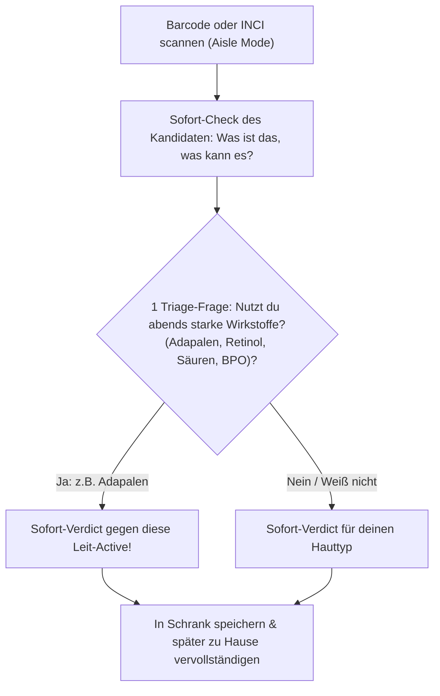

# Schrank-Datenmodell v0.2

Das Minimum, damit Scan gegen *deine* Routine rechnen kann — praxistauglich für den DACH-Drogerie-Alltag.

---

## 1. Objekte

```yaml
Nutzer:
  constraints[]: ["akne-prone", "sensibel", "trocken", "barrier_fragil"]
  begleitpflege_aktiv: true       # Automatisch true wenn Rx (Adapalen, BPO, etc.) im Schrank
  schrank[]: [Slot]

Slot:
  id: "slot_pm_active_a"
  tageszeit: "am" | "pm"
  modus: "default" | "modus_a" | "modus_b" | "pause"  # Wechsel-Slots / Skin Cycling!
  wechsel_mit: ["slot_pm_active_b"]                    # Mutex-Verknüpfung: wird nie am selben Tag gestapelt
  schritt: 1..5                                        # 1=Reinigen, 2=Hydratisieren, 3=Treat, 4=Creme, 5=SPF
  produkt: Produkt
  geoeffnet_am?: "2026-08-01"                          # PAO-Tracking

Produkt:
  name: "The Ordinary Azelaic Acid Suspension 10%"
  ean?: "769915190632"
  marke: "The Ordinary"
  schiene: "kosmetik" | "arzneimittel" | "support" | "unbekannt"
  land_signal: "eu" | "unsicher" | "nicht-eu"
  kategorie: "reiniger" | "serum" | "creme" | "spot" | "spf"
  claims: ["nicht-komedogen", "cruelty-free"]
  inci_liste[]: [INCI_Eintrag]
  pao_monate?: 12                                      # Period After Opening Symbol (6M, 12M, etc.)

INCI_Eintrag:
  inci: "Salicylic Acid"
  klasse?: "bha"
  position: 14                                         # Position in der INCI-Liste
  unter_1_prozent_vermutung: true                       # z.B. nach Phenoxyethanol, Xanthan Gum
  rolle: "primaer_active" | "hilfsstoff_spur"           # Verhindert Fehlalarme bei pH-Puffern / Konservierern

Stoff (Whitelist-Referenz):
  inci: "Azelaic Acid"
  klasse: "azelaic"
  evidenzen: [{ anliegen: "akne", grade: "mittel" }]
  eu_status: "frei" | "annex_iii" | "annex_ii" | "arzneimittel"

Regel (Konfliktmatrix):
  a_klasse: "retinoid_rx"
  b_klasse: "aha"
  code: "alternate_days" | "skip_stack" | "split" | "inactivate" | "same_class"
  prio: 40
```

---

## 2. Der Kernunterschied: Modus & Wechsel-Slots

Niemand mit Akne oder Actives cremt 7 Tage die Woche exakt dasselbe.  
**Prim nutzt Modus A (Adapalen) und Modus B (Clienzo/Spot).**  
Andere nutzen: *Tag 1 Retinoid, Tag 2 BHA/AHA, Tag 3 Barriere-Pause (Skin Cycling).*

* **Alte Logik:** Schrank hat Adapalen und Clienzo abends ➔ Fehlalarm `skip_stack` („Nicht zusammen!“), obwohl die Nutzerin sie an getrennten Tagen nimmt.
* **Neue Logik v0.2:** Produkte in verschiedenen Modi (`modus_a` vs `modus_b`) oder mit `wechsel_mit`-Flag werden **nicht** als Reiz-Stacking am selben Abend gerechnet. Die Matrix prüft:
  1. *Stacking am selben Abend* (in derselben Routine)
  2. *Wochenbelastung / Reiz-Summe* (wird gewarnt, wenn an 7 Tagen nur Säuren & Retinoide ohne Pause laufen)

---

## 3. INCI-Heuristik (1 %-Linie gegen Fehlalarme)

In vielen Cremes steht `Salicylic Acid` oder `Lactic Acid` ganz am Ende als Konservierungsverstärker oder pH-Puffer (< 0,2 %).
* Steht der Stoff **hinter** Indikatoren wie *Phenoxyethanol, Ethylhexylglycerin, Carbomer, Xanthan Gum, Disodium EDTA*?
* ➔ Flag: `hilfsstoff_spur`.
* ➔ **Kein** Alarm „Du kombinierst Retinol mit BHA!“, sondern Einstufung als reines Support-Produkt.

---

## 4. Scan-First Onboarding (Zero-Friction Einstieg)

Wenn eine Nutzerin im dm vor dem Regal steht, hat sie keine Zeit, 8 Produkte manuell einzutippen:



---

## 5. Verdict (ein Scan)

Drei Zeilen in 3 Sekunden:

1. **Zu dir:** Passt zu deinen Tags & Barriere-Status.
2. **Zu deinem Schrank:**
   - 🟢 `passt` ➔ Gehört in Schritt X morgens/abends.
   - 🟡 `wechsel` (`alternate_days`) ➔ Tolles Produkt, aber **nur an Abenden ohne dein Retinoid / BPO**.
   - 🔴 `lieber_nicht` ➔ Reiz-Stacking, inaktiviert Wirkstoff oder ist redundant.
3. **Im selben Regal:** Wenn 🟡 oder 🔴 ➔ 2–3 Alternativen, die im selben Laden stehen.
